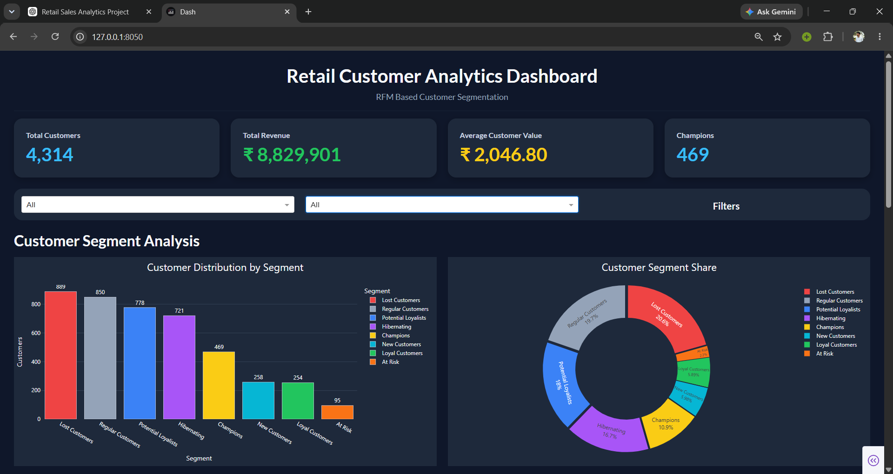
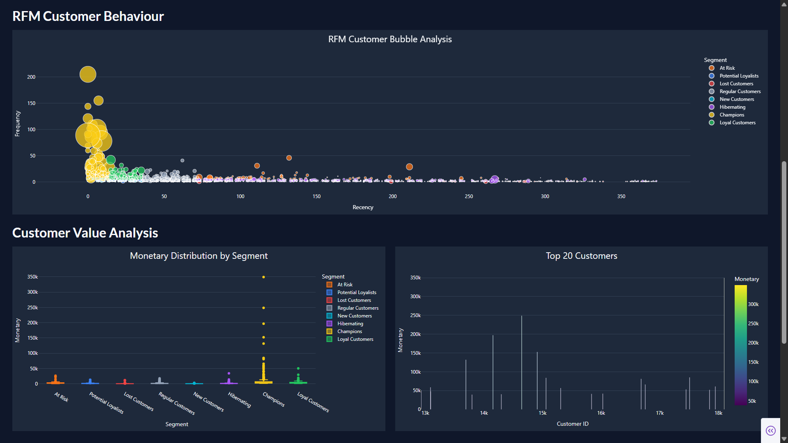
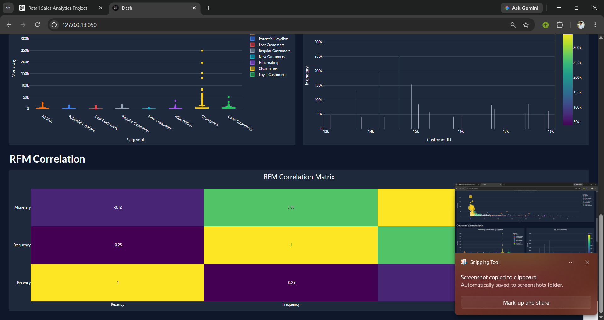

# 🛍️ Retail Customer Analytics Dashboard
### End-to-End Customer Segmentation using RFM Analysis & Plotly Dash


---

## 📖 Project Overview

Retail businesses generate massive transactional data every day. However, transforming this raw data into actionable business insights is often challenging.

This project demonstrates an **end-to-end customer analytics workflow** using **RFM (Recency, Frequency, Monetary) Analysis** to segment customers based on purchasing behaviour and visualize insights through an **interactive Plotly Dash dashboard**.

The project follows a complete analytics pipeline from **raw transactional data** to a **fully interactive business dashboard**.

---

# 🚀 Dashboard Preview

## 🏠 Dashboard Home



---

## 📊 Customer Behaviour Analysis



---

## 📈 Customer Value & Correlation Analysis



---

# 🎯 Project Objectives

- Clean raw retail transaction data
- Perform customer-level RFM analysis
- Segment customers based on purchasing behaviour
- Identify valuable customer groups
- Generate business insights
- Develop an interactive analytics dashboard

---

# 📊 Dashboard Features

### 📌 KPI Cards

- Total Customers
- Total Revenue
- Average Customer Value
- Champions Count

### 🎛 Interactive Filters

- Customer Segment Filter
- Dynamic Dashboard Updates

### 📈 Interactive Visualizations

- Customer Segment Distribution
- Segment Percentage (Donut Chart)
- RFM Bubble Analysis
- Monetary Distribution
- Top Spending Customers
- Correlation Heatmap

---

# 🧠 RFM Analysis

The segmentation is based on three customer behaviour metrics.

| Metric | Description |
|---------|-------------|
| **Recency** | Days since customer's last purchase |
| **Frequency** | Number of unique purchases |
| **Monetary** | Total amount spent by customer |

Customers are assigned RFM scores and grouped into meaningful business segments.

---

# 👥 Customer Segments

- 🏆 Champions
- 💙 Loyal Customers
- ⭐ Potential Loyalists
- 👤 Regular Customers
- 🆕 New Customers
- ⚠️ At Risk
- 😴 Hibernating
- ❌ Lost Customers

---

# 📂 Project Structure

```text
Retail-Customer-Segmentation/
│
├── dashboard/
│   ├── app.py
│   ├── callbacks.py
│   ├── charts.py
│   ├── components.py
│   ├── data.py
│   └── theme.py
│
├── datasets/
│   ├── rfm_main.csv
│   ├── rfm.csv
│   ├── online_retail_rfm_working_data.csv
│   └── ...
│
├── images/
│   ├── dashboard_images/
│   │   ├── dashboard-1st-page.png
│   │   ├── dashboard-2nd-page.png
│   │   └── dashboard-3rd-page.png
│   │
│   └── notebook_images/
│       ├── average-monetary-value-by-segment.png
│       ├── average-purchase-frequency.png
│       ├── average-recency-days-since-last-purchase.png
│       ├── customer-segment-treemap.png
│       ├── top-10-spenders.png
│       └── ...
│
├── notebooks/
│
└── README.md
```

---

# 🧹 Data Cleaning

The following preprocessing steps were performed before analysis.

- Removed cancelled invoices
- Removed missing Customer IDs
- Removed duplicate records
- Converted Invoice Date into datetime format
- Created Total Sales feature
- Generated customer-level RFM dataset

---

# 📈 Business Insights

The analysis revealed several important customer behaviour patterns.

- Champions contribute the highest revenue.
- Lost Customers represent a large portion of inactive users.
- Frequency has a strong positive relationship with Monetary value.
- Customers purchasing more frequently generally spend significantly higher amounts.
- Customer segmentation can help businesses design targeted marketing campaigns.

---

# 💻 Technology Stack

### Programming

- Python

### Data Analysis

- Pandas
- NumPy

### Visualization

- Plotly
- Plotly Express

### Dashboard

- Dash
- Dash Bootstrap Components

### Development Tools

- Jupyter Notebook
- VS Code

---

# ⚙️ Installation

Clone the repository

```bash
git clone https://github.com/ankush-kumar-singh/Retail-Customer-Segmentation.git
```

Move inside the project

```bash
cd Retail-Customer-Segmentation
```

Install dependencies

```bash
pip install -r requirements.txt
```

Run the dashboard

```bash
python dashboard/app.py
```

---

# 📌 Future Improvements

- Machine Learning based Customer Segmentation
- Customer Churn Prediction
- Customer Lifetime Value Prediction
- Recommendation System
- PDF Report Export
- SQL Database Integration
- Cloud Deployment

---

# 👨‍💻 Author

**Ankush Kumar Singh**

🎓 B.Tech CSE (Data Science)

💼 Data Analytics | Machine Learning | Business Intelligence

### Connect with Me

- GitHub: https://github.com/ankush-kumar-singh
- LinkedIn: www.linkedin.com/in/ankush-kumar-singh-04bb78243

---

## ⭐ If you found this project useful, consider giving it a Star.